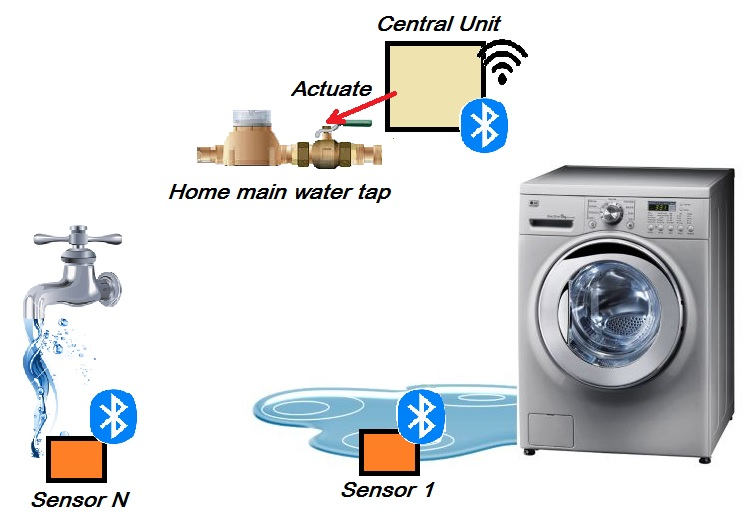

# Water leaks motinoring system

## System overview

## Features
* Easy integration: The system can be easy integrated into existing environment, no additional wires and pipes replacements.
* Flexible configuration: The system can support different count of water leak sensors, it's easy to add or remove water leak sensor during runtime operation.
* User friendly interface: The system is using simple web interface for configuration and monitoring.
* Non-volatile operation: The system can work without electricity due to backup power supply.
* Low power consumption: Due to used technologies the system use low electricity
* No high voltage: All system components are working with safe 12 volts power supply.
* New technologies: BLE sensors, WI-FI access, WEB user interface.
