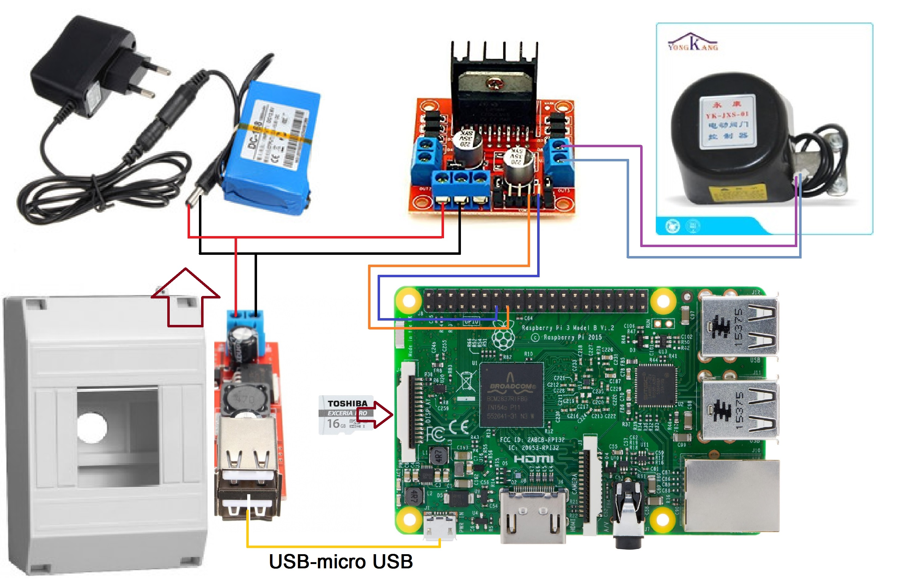

## Central unit

### HW specification

|Item              |Type                          |Count|Seller link                                                                                                                                                                                                               |
|------------------|------------------------------|-----|--------------------------------------------------------------------------------------------------------------------------------------------------------------------------------------------------------------------------|
|MCU unit          |Raspberry Pi 3 model B        |1    |[original raspberry pi 3 model b](https://www.aliexpress.com/item/In-stock-2015-New-Original-Raspberry-Pi-2-Model-B-1GB-RAM-900Mhz-Quad-Core-ARM/32475849620.html?spm=2114.13010708.0.0.BtPETU)                           |
|SD card           |THN-M401S0160E2               |1    |[Toshiba Excerial Pro microSDHC](https://rozetka.com.ua/tshba_microsdhc_pro_16gb_c10_m401s0160e2/p15933949/)                                                                                                              |
|Motor driver      |board module L298             |1    |[L298N motor driver](https://www.aliexpress.com/item/Special-promotions-5pcs-lot-L298N-motor-driver-board-module-L298-for-arduino-stepper-motor-smart-car/1827893830.html?spm=2114.13010708.0.0.bDcz0l)                   |
|5V DC-DC          |USB Charge DC-DC Step-down    |1    |[USB Charge DC-DC Step-down](https://www.aliexpress.com/item/DC-6V-40V-To-5V-3A-Double-USB-Charge-DC-DC-Step-down-Converter-Module/32664778995.html?spm=2114.search0104.3.2.kEU2vI&ws_ab_test=searchweb0_0,searchweb201602_1_10152_10170_10065_10151_10068_10326_10084_10083_10080_10307_10082_10081_10110_10137_10111_10060_10112_10113_10155_10114_10154_10056_10055_10054_10312_10313_10059_10314_10315_100031_10099_10078_10079_10103_10073_10102_10052_10053_10142_10107_10050_10051-10052_10110,searchweb201603_3,ppcSwitch_5&btsid=f8e5297e-bf45-4b2f-9ce3-2039edf0a898&algo_expid=a3243491-fae2-42a2-a977-101cb692e6c8-0&algo_pvid=a3243491-fae2-42a2-a977-101cb692e6c8&transAbTest=ae803_3) |
|Valve actuator    |Yongkang Black Color DN20/DN25|1    |[Yongkang Black Color](https://www.aliexpress.com/item/Yongkang-Black-Color-DN15-LPG-Gas-Valve-Water-Valve-for-Automatic-Shut-Off/32779379748.html?spm=2114.13010708.0.0.0MOlvw)                                          |
|Backup PSU        |Lithium Ion battery pack      |1    |[Lithium Ion battery pack](https://www.aliexpress.com/item/Portable-Super-Rechargeable-Lithium-Ion-battery-pack-capacity-DC-12-V-6800-Mah-CCTV-Cam-Monitor/32692388612.html?spm=2114.13010708.0.0.J3SN5L)                 |
|Box               |---                           |1    |---                                                                                                                                                                                                                       |
|Wires             |---                           |---  |---                                                                                                                                                                                                                       |

#### HW connection

## Raspberry PI preparation
### Upgrade raspberry
    sudo apt-get update
    sudo apt-get dist-upgrade
### Setup WIFI
    sudo nano /etc/network/interfaces

    auto lo
    iface lo inet loopback

    auto wlan0
    iface wlan0 inet static
    address 192.168.0.10
    netmask 255.255.255.0
    gateway 192.168.0.1
    wpa-essid ap_name
    wpa-psk ap_pass
    
### Clone repository to home folder on Raspberry Pi
    sudo apt-get install git
    ssh-keygen -t rsa
    git clone git@github.com:andriy-bilynskyy/SmartHouse.git 
### Install Apache
    sudo apt-get install apache2
### Install SQL
    sudo apt-get install mysql-server
### Install PHP
    sudo apt-get install php5 libapache2-mod-php5 php5-mysql    
### Relocate Apache html content 
    sudo /etc/init.d/apache2 stop
    sudo rm -R html/
    sudo ln -s /home/pi/SmartHouse/central/www/ /var/www/html
    sudo /etc/init.d/apache2 start
### Install Bluetooth
    sudo apt-get install bluetooth bluez
    
### NGINX (optional instead of appache)
 
	sudo apt-get install nginx
	sudo apt-get install php5-fpm
	sudo nano /etc/nginx/sites-enabled/default

	index index.php index.html index.htm;

	# pass the PHP scripts to FastCGI server listening on 127.0.0.1:9000
	#
	location ~ \.php$ {
		include snippets/fastcgi-php.conf;

		# With php5-cgi alone:
	#       fastcgi_pass 127.0.0.1:9000;
		# With php5-fpm:
		fastcgi_pass unix:/var/run/php5-fpm.sock;
	}

	sudo /etc/init.d/nginx reload
	sudo /etc/init.d/nginx start
	