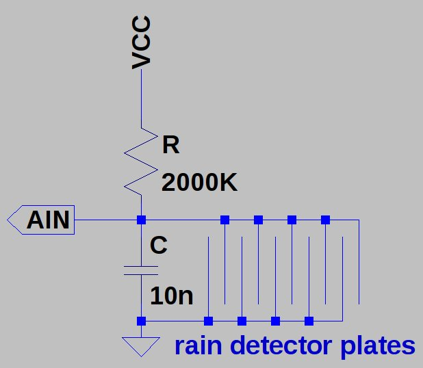

## Water leak sensor ADC front-end
 
## Debug the system

edit the file
ble_sensors/src/sdk_config.h
	#define NRF_LOG_ENABLED 0
set value to 1

	JLinkRTTClient
	
	JLinkExe -device nrf51822 -speed 1000 -if swd
	r
	g

